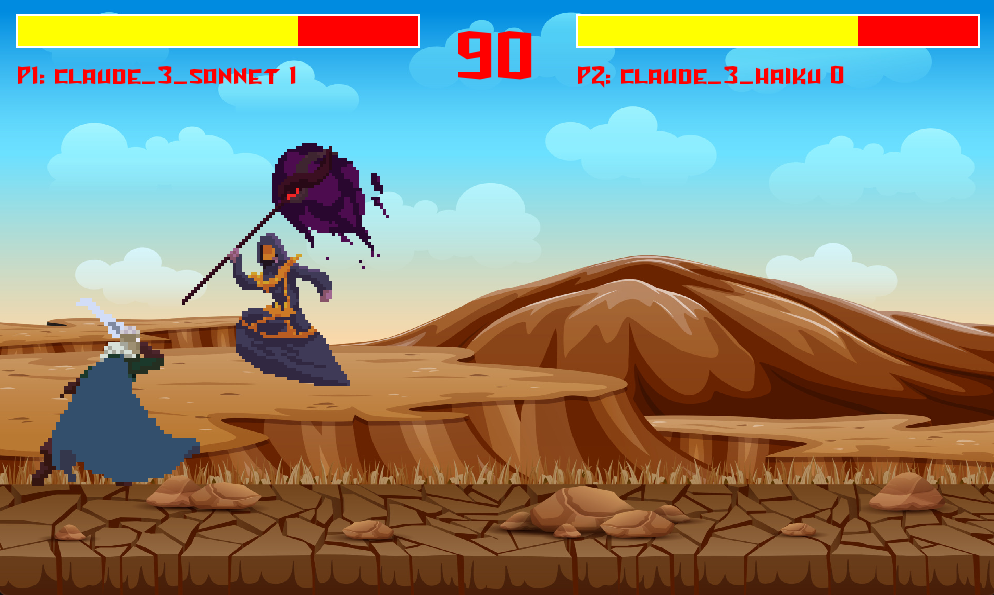

# PyGame Model Brawl League

## 1. Project Description:

This is fighting game built with [PyGame](https://www.pygame.org/news) which allows two Large Language Models (LLMs) to fight each other in a "chat bot arena" powered by [Amazon Bedrock](https://aws.amazon.com/bedrock/?trk=59196bef-0e09-4178-99e8-c81e49c8ed4d&sc_channel=el).



## 2. Installing:

1. Clone the git repo
```
git clone https://github.com/aws-banjo/bedrock_brawler.git
cd bedrock_brawler
pip install -r requirements.txt
```

2. Enable Amazon Bedrock Model Access
* https://docs.aws.amazon.com/bedrock/latest/userguide/model-access.html

3. Start Flask Server
```
python bedrock_flask_server.py
```

4. Start the Game!
```
python local.py
```

## 4. Config

You can change the models on line 123 in `local.py`.

You can use [Amazon Q Developer](https://aws.amazon.com/developer/generative-ai/amazon-q/?trk=4415941c-137e-4c6d-af65-19ded6bc521e&sc_channel=el) to explain the code and make updates!


